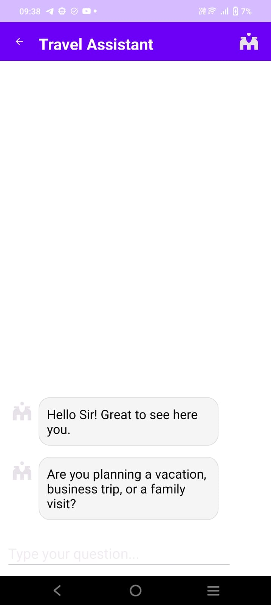
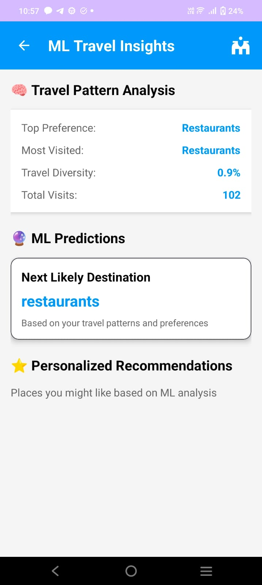
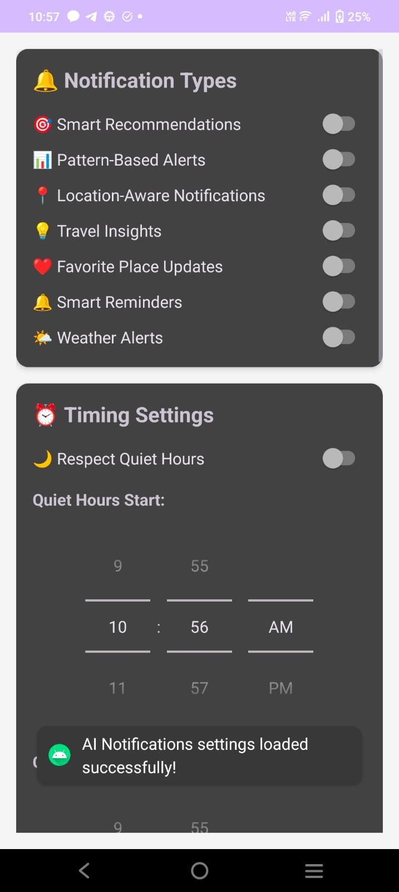
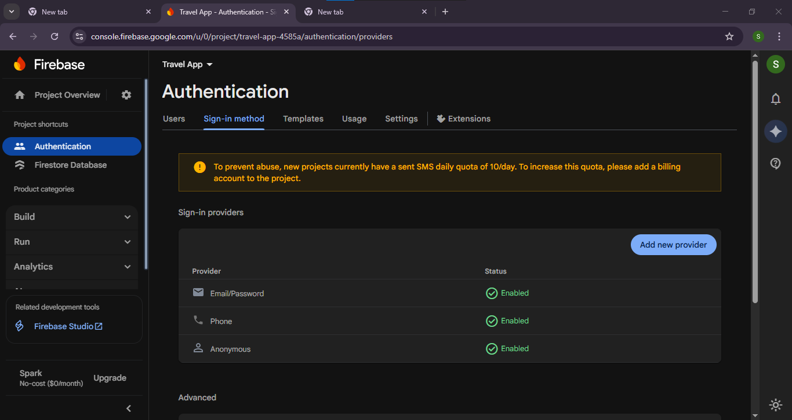
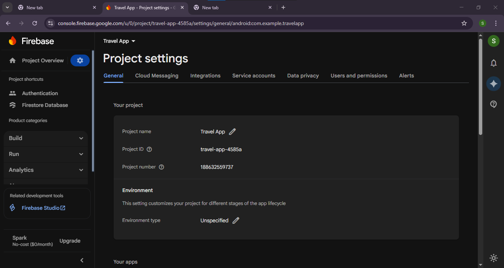
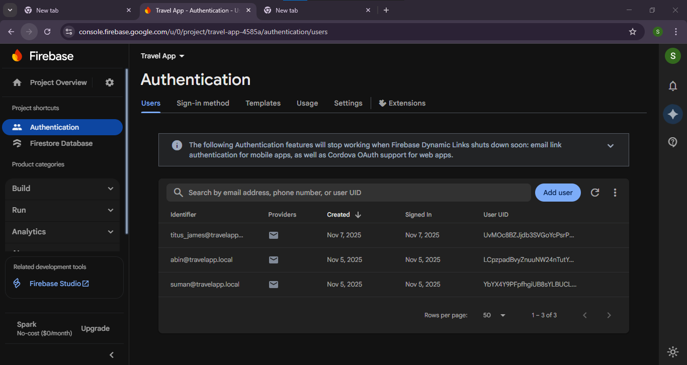

# 🗺️ Travel Companion Android Application (TRAVE_APP)

A feature-rich Android travel assistant that helps users discover nearby places, get AI-powered recommendations, explore maps, receive smart notifications, and sync travel data using Firebase.
Designed primarily for **Navi Mumbai (Vashi, Nerul, Juinagar, Turbhe)** with a curated local dataset, but fully customizable to support **any city or region**.

---

## 🔍 Overview

Travel Companion App is an intelligent Android travel assistant aimed at delivering a smooth, personalized travel experience.
Although the app is mainly developed for **Navi Mumbai**, users or developers can easily modify the dataset to support any city.

The app enables users to:

* Explore nearby places with accurate GPS + maps
* View categorized places like restaurants, cafes, malls, parks, hotels
* Get travel suggestions using Local AI Assistant or Gemini AI
* Experience ML-based personalized recommendations
* Receive smart, pattern-based and location-based notifications
* Capture photos, videos, and voice notes
* Sync favorites, history, and personal data using Firebase
* Use curated Navi Mumbai dataset offline when APIs are inaccessible

---

## 📸 Screenshots













---

## ✨ Features

### 🌍 Google Maps Integration

* Live location tracking
* Category-based markers (cafes, restaurants, hotels, parks, malls, etc.)
* 2km radius nearby search
* Clean and interactive map interface
* Offline fallback dataset for Navi Mumbai

### 🤖 AI Chatbot System

Local Travel Assistant (Offline)

* 7-step guided onboarding
* Detects keywords like hotels, restaurants, cafes, malls
* Works fully offline using the local dataset
* Instant answers for Navi Mumbai locations

Gemini AI Cloud Assistant (Optional)

* Advanced responses using Google Gemini
* Uses user history and category preferences
* Smart fallback to Local Assistant when needed

### 🧠 Machine Learning Recommendations

* Personalized suggestion engine
* Understanding user search patterns and frequent categories
* Intelligent search with ranking and fuzzy matching
* Travel diversity score
* ML insights dashboard to visualize travel behavior

### 🔔 AI Notifications

* Personalized travel suggestions
* Location-aware alerts
* Weekly insights on travel habits
* Smart reminders based on frequently visited categories
* User preference controls and quiet hours

### ☁️ Firebase Cloud Sync

* Syncs favorites, history, visited places
* Real-time data updates
* Works offline and syncs later
* Optional—app still works without Firebase

### 📍 Navi Mumbai Local Dataset

* Pre-loaded Vashi, Nerul, Juinagar, Turbhe places
* Includes hotels, malls, cafes, restaurants, parks, hostels
* Each entry contains coordinates, rating, address, and category
* Fully editable JSON file

### 🎒 Picnic Tools

* Photo capturing
* Video recording
* Audio note recording
* Saved automatically via MediaStore

### 🎨 User Interface

* Material Design 3
* Responsive and modern layout
* Smooth animations (fade, slide, pulse)
* Dark mode friendly

---

## 🛠️ Technical Stack

* Language: Java
* Architecture: MVVM
* Local Database: Room
* Cloud: Firebase Firestore
* AI: Local Assistant + Gemini AI
* ML: TensorFlow Lite + recommendation engine
* Maps: Google Maps SDK + Places API
* UI: Material Design 3

---

## 📱 Screens Included

* Splash Screen
* Main Home Screen
* Category Options
* Map Activity
* Chatbot (Local + Gemini)
* ML Insight Dashboard
* Picnic Tools – Camera, Video, Audio
* Notification Settings
* Favorites & Directory views

---

## 📲 Prerequisites

* Android Studio (latest version recommended)
* JDK 11+
* Android SDK API Level 24+
* Google Cloud Console API key for Maps
* Firebase account (optional)

---

## 🚀 Installation

1. Clone the repository

   ```
   git clone <your-repo-url>
   cd TRAVE_APP
   ```
2. Open the project in Android Studio
3. Add your **Google Maps API key** inside the manifest
4. (Optional) Add your **Firebase google-services.json** file
5. Run the application on emulator or device

---

## 📖 Usage Guide

* Select a category → View nearby places on map
* Ask the Local AI Assistant or Gemini Assistant for help
* Explore ML insights for personalized suggestions
* Add or remove favorites
* Use photo/video/audio tools
* Allow and manage AI travel notifications
* Modify dataset JSON to customize app for any city

---

## 🤝 Contributing

* Fork the repository
* Create a new branch
* Commit your improvements
* Submit a pull request

---

## 📄 License

MIT License — free for use and modification.

---

## 🙏 Acknowledgments

Google Maps • Firebase • Gemini AI • TensorFlow Lite • Material Design 3 • Android Jetpack

---
